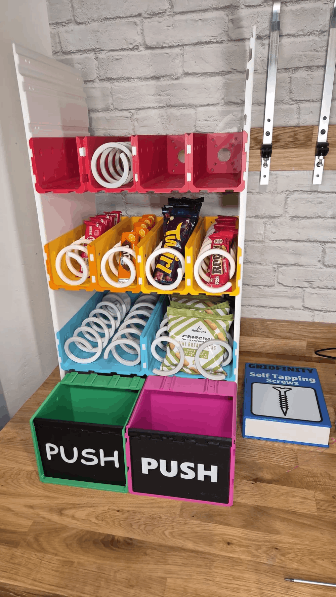
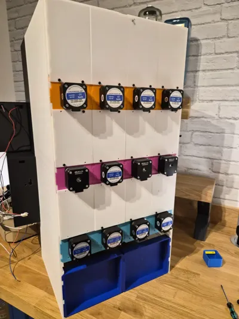
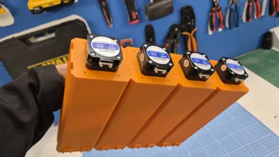

# Projet-dam-a26
## Distributeur automatique modulaire :

### Contexte :
Dans le cadre du cours planification de projet nous devons produire un projet d'électronique pouvant être utilisés par les futurs étudiants afin de mettre en pratique diverses leçons vues en classes.
### Objectif :
Ce projet a pour objectif de produire une machine distributrice automatique modulaire pouvant être personnalisée au gout du client que se sois selon la taille ou la couleur désirée mais aussi les moyens de paiements et les interfaces de contrôle désirés par celui-ci. 
### Structure du dépôt :
[Projet-dam-a26]
|
|- README.md
|
|- images/
|  |- bacs-et-moteurs.png
|  |- boite-de-dos.png
|  |- boite-de-face.png
|  |- distributeur-sans-boite.png
|
|- projet-original/
|  |- documentations/
|  |  |- Electronics Guide.pdf
|  |  |- Vending Bill of Materials- Bill of Materials(1).pdf
|  |  |- Vending Machine Build Guide (1).pdf
|  |- stl-originaux/
|     |- Accessoires/
|     |  |- Accesories.3mf
|     |  |- Black Keypad Plate.stl
|     |  |- Coin Reader.stl
|     |  |- Coin Tray.stl
|     |  |- Door solenoid Cover.stl
|     |  |- Door solenoid.stl
|     |  |- Flast Keypad.stl
|     |- Coils/
|     |  |- Coil 5 Items Left Hand.stl
|     |  |- Coil 5 Items Right Hand.stl
|     |  |- Coil 6 Items Left Hand.stl
|     |  |- Coil 6 Items Right Hand.stl
|     |  |- Coil 7 Items Left Hand.stl
|     |  |- Coil 7 Items Right Hand.stl
|     |  |- Coil 8 Items Left Hand.stl
|     |  |- Coil 8 Items Right Hand.stl
|     |  |- Coil 9 Items Left Hand.stl
|     |  |- Coil 9 Items Right Hand.stl
|     |  |- Coils.3mf
|     |- Door/
|     |  |- Bottom Door Corner Hinge.stl
|     |  |- Door 150mm Spacer(1)(1).stl
|     |  |- Door Bottom Corner Latch.stl
|     |  |- Door Bottom Corner Right.stl
|     |  |- Door Glass Holder.stl
|     |  |- Door Joiner.stl
|     |  |- Door Straight Hinge.stl
|     |  |- Door Straight Latch.stl
|     |  |- Door Straight.stl
|     |  |- Door Top Corner Hinge.stl
|     |  |- Door Top Corner Right.stl
|     |  |- Door.3mf
|     |- Front Sides/
|     |  |- Front Side Bottom Hinge.stl
|     |  |- Front Side Bottom Right.stl
|     |  |- Front side Hinger v2.stl
|     |  |- Front Side Joiner Plate.stl
|     |  |- Front Side Right Door Latch.stl
|     |  |- Front Side Right.stl
|     |  |- Front Sides.3mf
|     |  |- Joiner Front Side to Module Side.stl
|     |- Keypad/
|     |  |- Button 0.stl
|     |  |- Button 1.stl
|     |  |- Button 2.stl
|     |  |- Button 3.stl
|     |  |- Button 4.stl
|     |  |- Button 5.stl
|     |  |- Button 6.stl
|     |  |- Button 7.stl
|     |  |- Button 8.stl
|     |  |- Button 9.stl
|     |  |- Button A.stl
|     |  |- Button B.stl
|     |  |- Button C.stl
|     |  |- Button D.stl
|     |  |- Button OK.stl
|     |  |- Button X.stl
|     |  |- Keypad Body.stl
|     |  |- Keypad Front Plate.stl
|     |- Lid/
|     |  |- Front Lid Edge v2.stl
|     |  |- Front Lid Joiner.stl
|     |  |- Front Lide Plate.stl
|     |  |- Lid Edge v2.stl
|     |  |- Lid Joiner.stl
|     |  |- Lide Plate.stl
|     |  |- Lid.3mf
|     |  |- Plate Joiner.stl
|     |- Module Sides/
|     |  |- Bottom Module Side.stl
|     |  |- Module Side.stl
|     |  |- Module Sides.3mf
|     |- Modules/
|     |  |- Back Stand Joiner.stl
|     |  |- Back Stand.stl
|     |  |- Double Label.stl
|     |  |- Double Module.stl
|     |  |- Lid Edge.stl
|     |  |- Module Joiner.stl
|     |  |- Modules.3mf
|     |  |- Push Bin Joiner.stl
|     |  |- Push Bin.stl
|     |  |- Push Flap Non-AMS.stl
|     |  |- Push Flap.stl
|     |  |- Single Back Plate Top.stl
|     |  |- Single Back Plate.stl
|     |  |- Single label.stl
|     |  |- Single Module.stl
|     |- 3x4 Vending Machine Module Print List - Model Print List.pdf
|- scrum/
|  |- carnet-de-produit/
|  |  |- carnet-de-produit.md
|  |  |- objectif-de-produit.md
|  |- sprint-1
|  |  |- carnet-de-produit.md
|  |  |- carnet-de-sprint.md
|  |  |- objectif-de-sprint.md
|  |  |- retro-de-sprint.md
|  |  |- revue-de-sprint.md
|  |- sprint-2
|  |  |- carnet-de-produit.md
|  |  |- carnet-de-sprint.md
|  |  |- objectif-de-sprint.md
|  |  |- retro-de-sprint.md
|  |  |- revue-de-sprint.md
|  |- sprint-3
|  |  |- carnet-de-produit.md
|  |  |- carnet-de-sprint.md
|  |  |- objectif-de-sprint.md
|  |  |- retro-de-sprint.md
|  |  |- revue-de-sprint.md
|  |- LICENSE

