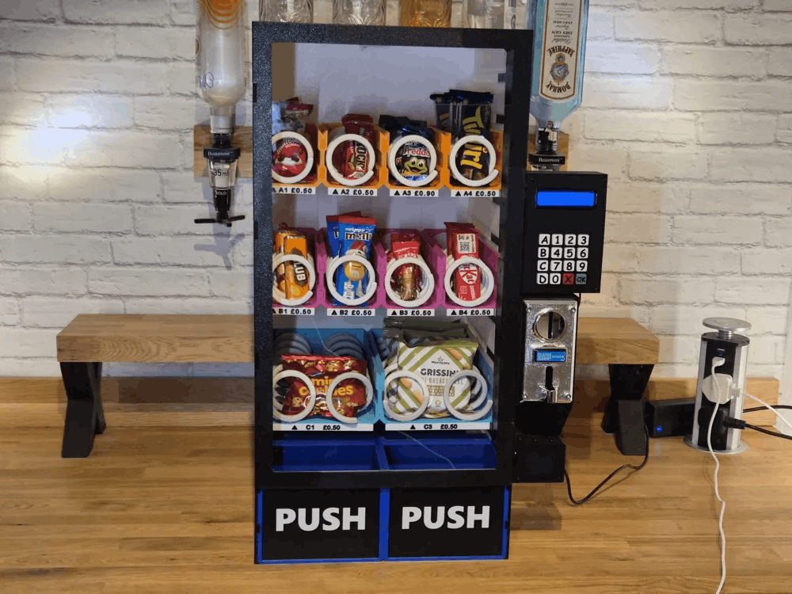

# Projet-dam-a26
## Distributeur automatique modulaire :

### Contexte :
Dans le cadre du cours planification de projet nous devons produire un projet d'électronique pouvant être utilisés par les futurs étudiants afin de mettre en pratique diverses leçons vues en classes.
### Objectif :
Ce projet a pour objectif de produire une machine distributrice automatique modulaire pouvant être personnalisée au gout du client que se sois selon la taille ou la couleur désirée mais aussi les moyens de paiements et les interfaces de contrôle désirés par celui-ci. 
### Structure du dépôt :
[Projet-dam-a26]    
- README.md  
- images  
  - Ensemble des images utilisées dans la documentation.     
- projet-original  
  - documentations  
     - Documentation originale fournie avec les fichiers originaux permettant la reproduction du projet.  
  - stl-originaux  
     - Accessoires  
       - Ensemble des fichiers 3d afin de produire les différents accessoires.  
     - Coils  
        - Ensemble des fichiers 3d afin de produire les différentes variantes de vis sans fin.  
     - Door  
       - Ensemble des fichiers 3d afin de produire les différentes pièces nécessaire pour la porte de la machine.  
     - Front Sides  
       - Ensemble des fichiers 3d afin de produire les différentes pièces nécessaire pour le devant de la machine.  
     - Keypad  
       - Ensemble des fichiers 3d afin de produire les différentes pièces nécessaire pour le clavier de la machine.  
     - Lid  
       - Ensemble des fichiers 3d afin de produire les différentes pièces nécessaire pour le couvercle de la machine.  
     - Module Sides  
       - Ensemble des fichiers 3d afin de produire les différentes pièces nécessaire pour les cotes de la machine.  
     - Modules  
       - Ensemble des fichiers 3d afin de produire les différentes pièces nécessaire pour les modules contenant les differents produits a vendre.  
- scrum  
  - carnet-de-produit  
    - Ensemble de la documentation expliquant la vision du projet et les diverses fonctionnalites prevus pour la machine.   
  - sprint-1  
    - Ensemble de la documentation expliquant l'objectif sur sprint 1, les diverses taches a effectuer et la rétroaction a la fin de celui-ci.  
  - sprint-2  
    - Ensemble de la documentation expliquant l'objectif sur sprint 1, les diverses taches a effectuer et la rétroaction a la fin de celui-ci.  
  - sprint-3  
    - Ensemble de la documentation expliquant l'objectif sur sprint 1, les diverses taches a effectuer et la rétroaction a la fin de celui-ci.  
  - LICENSE  

### Démarage
Afin de faire fonctionner le produit il suffira de le brancher a une source de tension 120v, de le remplir et d'indiquer les prix desirer pour les items a l'aide du code administrateur sur l'interface utilisateur.
